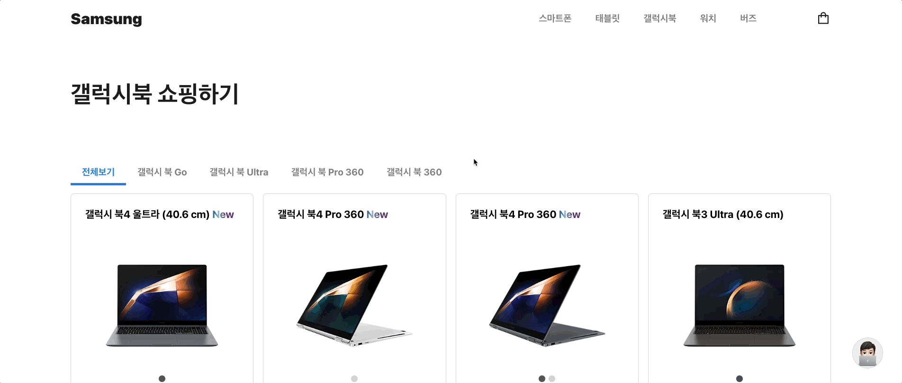
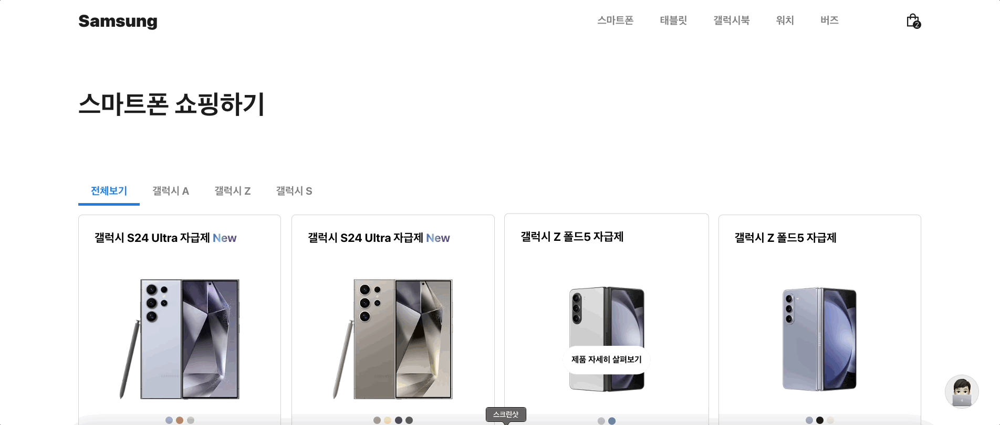

# 🔍 Preview

| pc | mobile |
| --- | --- |
|  |  |

 

# 🥸 [Enterprise-Web-Page](https://teal-mandazi-2a1254.netlify.app/)

`#기업형웹페이지` `#커머스` `#삼성전자` `#회사소개` `#제품판매`

삼성전자를 소개하고 제품을 판매하는 종합 플랫폼으로, 사용자 관점에서 자연스러운 흐름의 전자상거래 경험을 제공합니다. **Enterprise Page - JinKyu**   

**사이트 바로 가기 👉 [클릭!](https://teal-mandazi-2a1254.netlify.app/)**

 

# 🛠 Features

- Home
    - 홈 페이지의 첫 번째 섹션은 Swiper 라이브러리를 활용하여 기업을 소개하는 화면을 제공합니다. 부드러운 슬라이드 형식으로 이미지가 전환되며 기업을 소개하였습니다.
    - 홈 페이지의 두 번째 섹션에서는 intersectionobserver를 활용하여 해당 섹션이 화면에 들어올 때 삼성전자의 최신 소식을 보여주는 요소들이 자동으로 올라오는 애니메이션을 적용하였습니다.

- Carts
    - 상품을 장바구니에 담으면 비로그인 상태에서는 상품 데이터를 LocalStorage에 저장하고, 로그인 상태라면 데이터를 Firebase realtime database에 저장합니다.
    - 장바구니에 담긴 상품은 수량을 조절하거나 장바구니에서 삭제할 수 있고, 장바구니에 담긴 모든 상품들의 총액을 계산하여 보여주고 있습니다.

-  NewProduct
    - 권한이 필요한 새로운 제품 등록페이지는 사용자가 권한이 있는지 없는지 확인하여 보여주고, url을 통한 페이지 접근을 막는 경로 보호 기능을 구현하였습니다.
    - Cloudinary 라이브러리를 사용하여 첨부한 파일을 브라우저에 업로드하고 firebase에 상품 관련 데이터를 저장합니다.
     

-  Payments
    - 주문 상품과 배송지 정보를 검토하고 tosspayments를 사용하여 결제 ui를 제공합니다.
     

-  ChatBotModal
    - React Simple Chatbot 라이브러리를 사용하여 신속한 상담 및 고객 편의를 제공하기 위한 챗봇 상담 서비스를 구현하였습니다.
     
 

# 🪃 Skills

## Client

- React
- React Router
- React Query
- React Icons
- React Simple Chatbot
- Swiper
- Tosspayments
- Cloudinary

## Server

- Firebase

 

# 🪛 Project Control

- Version Control: Git, Github
- Task Control: Notion

 

# 🚀 Deployment

- Client: Netlify

 
